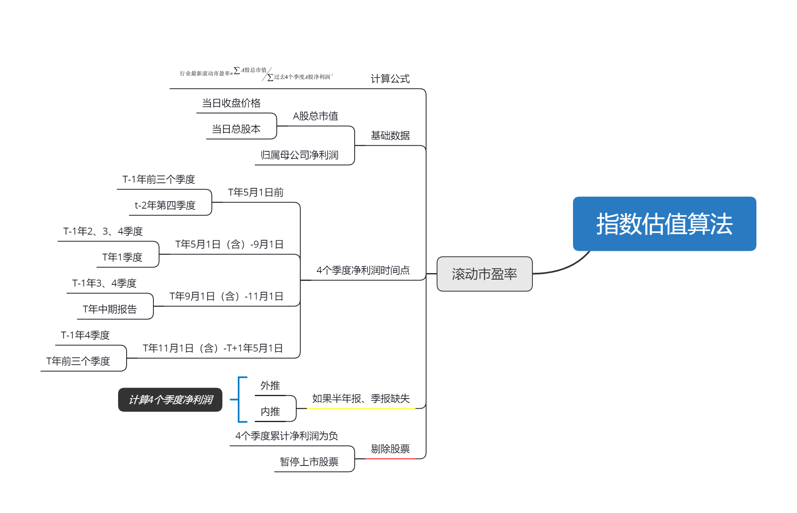

# index_valuation
指数估值相关。

## 指数市盈率

参照中证指数[A股全市场行业滚动市盈率计算说明](http://www.csindex.com.cn/uploads/downloads/pe_ratio/files/gdsyl.pdf)，整理如下：

## 数据核对

笔者通过wind，选择了中国平安、贵州茅台、科大讯飞、长园集团四家公司的数据，计算2019年8月20日的滚动市盈率：

| 证券代码  | 证券简称 | 归属母公司股东的净利润            [报告期] 今年一季            [报表类型] 合并报表            [单位] 亿元 | 归属母公司股东的净利润            [报告期] 去年年报            [报表类型] 合并报表            [单位] 亿元 | 归属母公司股东的净利润            [报告期] 去年三季            [报表类型] 合并报表            [单位] 亿元 | 归属母公司股东的净利润            [报告期] 去年中报            [报表类型] 合并报表            [单位] 亿元 | 归属母公司股东的净利润            [报告期] 去年一季            [报表类型] 合并报表            [单位] 亿元 | 收盘价            [交易日期] 2019-08-20            [复权方式] 前复权            [单位] 元 | 总股本            [交易日期] 2019-08-20            [单位] 亿股 | A股合计            [交易日期] 2019-08-20            [单位] 亿股 | 去年四季度 | 去年三季度 | 去年二季度 | 过去四个季度净利润总和 | A股净利润 | A股市值  | 滚动市盈率 |
| --------- | -------- | ------------------------------------------------------------ | ------------------------------------------------------------ | ------------------------------------------------------------ | ------------------------------------------------------------ | ------------------------------------------------------------ | ------------------------------------------------------------ | ------------------------------------------------------------ | ------------------------------------------------------------ | ---------- | ---------- | ---------- | ---------------------- | --------- | -------- | ---------- |
| 601318.SH | 中国平安 | 455.1700                                                     | 1,074.0400                                                   | 793.9700                                                     | 580.9500                                                     | 257.0200                                                     | 87.94000                                                     | 182.8024                                                     | 108.3266                                                     | 280.07     | 213.02     | 323.93     | 1,272.19               | 753.89    | 9526.241 | 12.6362    |
| 600519.SH | 贵州茅台 | 112.2143                                                     | 352.0363                                                     | 247.3355                                                     | 157.6419                                                     | 85.0691                                                      | 1,070.00000                                                  | 12.5620                                                      | 12.5620                                                      | 104.70     | 89.69      | 72.57      | 379.18                 | 379.18    | 13441.34 | 35.4483    |
| 002230.SZ | 科大讯飞 | 1.0188                                                       | 5.4207                                                       | 2.1910                                                       | 1.3060                                                       | 0.8199                                                       | 32.76000                                                     | 22.0053                                                      | 22.0053                                                      | 3.23       | 0.89       | 0.49       | 5.62                   | 5.62      | 720.8936 | 128.282    |
| 600525.SH | 长园集团 | 0.6561                                                       | 1.1167                                                       | 12.7838                                                      | 11.4015                                                      | 0.8073                                                       | 6.29000                                                      | 13.2367                                                      | 13.2367                                                      | -11.67     | 1.38       | 10.59      | 0.97                   | 0.97      | 83.25884 | 86.23391   |

与中证指数官网给出的数值一致，计算逻辑应该正确。

| 证券代码 | 证券名称 | 一级行业代码 | 一级行业名称 | 二级行业代码 | 二级行业名称     | 三级行业代码 | 三级行业名称 | 四级行业代码 | 四级行业名称   | 个股静态市盈率 | 个股滚动市盈率 | 个股市净率 | 个股股息率 |
| -------- | -------- | ------------ | ------------ | ------------ | ---------------- | ------------ | ------------ | ------------ | -------------- | -------------- | -------------- | ---------- | ---------- |
| 601318   | 中国平安 | 06           | 金融地产     | 0604         | 保险             | 060401       | 保险         | 06040102     | 多元化保险     | 14.97          | 12.64          | 2.68       | 1.96       |
| 600519   | 贵州茅台 | 04           | 主要消费     | 0402         | 食品、饮料与烟草 | 040201       | 饮料         | 04020101     | 白酒           | 38.18          | 35.45          | 10.83      | 1.36       |
| 002230   | 科大讯飞 | 07           | 信息技术     | 0701         | 计算机运用       | 070103       | 软件开发     | 07010301     | 软件开发       | 132.99         | 128.28         | 8.82       | -          |
| 600525   | 长园集团 | 02           | 工业         | 0201         | 资本品           | 020104       | 电气设备     | 02010401     | 电气部件与设备 | 74.56          | 86.24          | 1.57       | -          |

**计算过程中需要注意A股、H股的划分，比如：中国平安，在A股和H股均上市，计算时采用的是A股净利润和A股总市值。**

**另外，当不同期财务报告的股本数量发生变动时，使用当期财务报告期末的股本数量计算 A股净利润。**

## 计算过程

基于中证指数公司的的计算方法，主要涉及到如下几个方面：

- 财务报表时间的选择；
- 归属母公司净利润确认，有部分公司是A+H股，需要基于不同的股本比例得到A股部分的净利润；
- 不同期的财务数据，计算最近四个季报方法有所不同。

### 季报数据处理方法

根据当前的时间，得到查询时间范围，然后从wind数据库中进行查询，得到当前时间最近的4个季报。

1、计算日期在T年5月1日之前

- 如果T年的5月1日之前（T年的一季报披露还没有结束），采用T-1年的前三个季报，以及T-2年的第4个季报；
- 查询日期范围从T-2年7月1日至T-1年9月30日；
- 查询的数据示例如下：

| DateTime   | SHARE_TOTALA | TOTAL_SHARES | NP_BELONGTO_PARCOMSH |
| ---------- | ------------ | ------------ | -------------------- |
| 2017/9/30  | 1256197800   | 1256197800   | 19983846984          |
| 2017/12/31 | 1256197800   | 1256197800   | 27079360256          |
| 2018/3/31  | 1256197800   | 1256197800   | 8506906678           |
| 2018/6/30  | 1256197800   | 1256197800   | 15764185783          |
| 2018/9/30  | 1256197800   | 1256197800   | 24733552720          |

- T-2年的四季报减去三季报，得到第四季度的数据，结合T-1年的三季报，得到最近四个季度的净利润。

2 、计算日期在T年的5月1日至9月1日

- T年一季报出，二季报还没有出完，采用T年的1季报 及T-1年的二、三、四季报；
- 查询日期范围从T-1年的1月1日至T年的3月31日；
- 查询的数据示例如下：

| DateTime   | TOTAL_SHARES | SHARE_TOTALA | NP_BELONGTO_PARCOMSH |
| ---------- | ------------ | ------------ | -------------------- |
| 2018/3/31  | 1256197800   | 1256197800   | 8506906678           |
| 2018/6/30  | 1256197800   | 1256197800   | 15764185783          |
| 2018/9/30  | 1256197800   | 1256197800   | 24733552720          |
| 2018/12/31 | 1256197800   | 1256197800   | 35203625263          |
| 2019/3/31  | 1256197800   | 1256197800   | 11221431345          |

- T-1年的年报减去一季报得到T-1年的二、三、四季度数据，然后加上T年的一季度，得到最近四个季度的净利润。

3、计算日期在T年的9月1日至11月1日

- T年二季报二季报已出，采用T年二季报和T-1年的3、4季报；
- 查询日期范围从T-1年4月1日到T年的6月30日；
- 查询的数据示例如下：

| DateTime   | TOTAL_SHARES | SHARE_TOTALA | NP_BELONGTO_PARCOMSH |
| ---------- | ------------ | ------------ | -------------------- |
| 2017/6/30  | 1256197800   | 1256197800   | 11250860930          |
| 2017/9/30  | 1256197800   | 1256197800   | 19983846984          |
| 2017/12/31 | 1256197800   | 1256197800   | 27079360256          |
| 2018/3/31  | 1256197800   | 1256197800   | 8506906678           |
| 2018/6/30  | 1256197800   | 1256197800   | 15764185783          |

- T-1年的年报减去二季报，得到T-1年的的三、四季度数据，加上T年一、二季度数据，得到最近四个季度的净利润。

4、计算日期大于T年的11月1日

- T年三季报已出，采用T年的三季报，和T-1年的四季报；
- 查询日期范围从T-1年的7月1日至T年的9月30日；
- 查询的数据示例如下：

| DateTime   | NP_BELONGTO_PARCOMSH | SHARE_TOTALA | TOTAL_SHARES |
| ---------- | -------------------- | ------------ | ------------ |
| 2017/9/30  | 19983846984          | 1256197800   | 1256197800   |
| 2017/12/31 | 27079360256          | 1256197800   | 1256197800   |
| 2018/3/31  | 8506906678           | 1256197800   | 1256197800   |
| 2018/6/30  | 15764185783          | 1256197800   | 1256197800   |
| 2018/9/30  | 24733552720          | 1256197800   | 1256197800   |

- T-1年的四季报减去三季报，得到第四季度的数据，然后加上T年的三季报，得到最近四个季度的净利润。